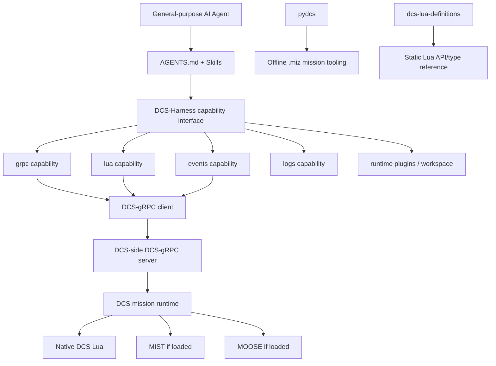

# DCS-Harness

[English](README.md) | [简体中文](README.zh-CN.md)


DCS-Harness is an open-source framework for bringing general-purpose AI Agents into DCS World as active participants in a live mission.

Instead of treating an AI model as a one-shot script generator, DCS-Harness is designed for Agents that continuously observe what is happening in the mission, reason about the current situation, take actions, and adapt to the consequences. This makes it possible to explore new roles for AI in DCS, such as dynamic mission directors, battlefield commanders, adaptive allies or opponents, game masters, and other forms of real-time scenario control.

The project does not try to replace DCS's existing scripting and mission ecosystem. Instead, it prepares that ecosystem so that an Agent can work with it directly, using the simulator's existing capabilities together with a lightweight layer of tools, runtime support, and Agent-facing knowledge.

At a broader level, DCS-Harness is also an experiment in how general-purpose AI Agents can interact with complex, mature software environments over long periods of time. DCS provides a particularly interesting setting for this because the Agent must operate inside a changing world, respond to a human player, use existing software interfaces, and continuously verify whether its actions actually had the intended effect.

> DCS-Harness is an independent community/research project and is not affiliated with or endorsed by Eagle Dynamics.

---

## Background

Modern AI Agents are beginning to interact with software in a fundamentally different way from conventional task-specific automation. Traditional integrations usually require developers to define the complete interaction surface in advance: APIs, workflows, state machines, action schemas, and orchestration logic. General-purpose coding and tool-using Agents can instead read documentation, inspect source code, discover interfaces, compose existing tools, generate temporary code, diagnose failures, and adapt their behavior from feedback. This raises a broader systems question: **how much of an existing software ecosystem can an Agent use directly if we provide a sufficiently good harness, rather than rewriting the ecosystem around the model?**

DCS World is an unusually rich environment for exploring that question. A DCS mission is a long-running, partially observable simulation with human player agency, persistent entities, tactical consequences, and a mature scripting ecosystem. Its interaction tempo is slower than many real-time action games, leaving room for deliberative Agents to observe, reason, intervene, and verify outcomes. At the same time, DCS already exposes substantial programmable infrastructure through the native mission Lua environment, DCS-gRPC, MIST, MOOSE, mission files, logs, and community tooling. This makes DCS more than a game environment: it is a realistic software ecosystem in which an Agent must decide what to inspect, which abstraction to use, what action to take, and whether that action actually changed the world as intended.

This also suggests a different direction for AI in games. Conventional game AI is often embedded directly into behavior trees, finite-state machines, handcrafted planners, scripted directors, or fixed NPC logic. A general-purpose Agent can potentially operate one level above those mechanisms: as a dynamic mission director, battlefield commander, adaptive game master, scenario orchestrator, or cooperative controller that continuously interprets what the player is doing and changes the environment in response. The interesting capability is not merely "an LLM writes Lua." It is the repeated loop of **observe → reason → act → verify → adapt** inside an existing simulation and tooling ecosystem.

More broadly, future game Agents may not be limited to controlling a single NPC. They may become software actors that can work across runtime state, mission logic, telemetry, content-generation tools, editors, debugging interfaces, persistent memory, and other parts of the game-development stack. In that world, game engines and modding ecosystems may increasingly need to serve not only as APIs for human developers, but also as **operating environments for Agents**.

Recent progress in general-purpose Agent harnesses has made this idea substantially more practical. Systems such as [DeepSeek Harness](https://www.deepseek.com/harness/) and other modern coding-agent environments emphasize a separation between the model and the surrounding harness: tools, skills, sessions, sandboxes, storage, persistent processes, and other capabilities can be composed around the Agent instead of being hard-coded into the model. DCS-Harness applies that systems idea to a live combat flight simulation. Rather than building a monolithic "LLM commander," it prepares DCS and its surrounding ecosystem so that a capable Agent can enter the environment, discover what is available, build task-local tools when needed, and remain in the control loop.

---

## How to Use

The fastest path is:

```text
DCS World
  + DCS-gRPC with Eval enabled
  + DCS-Harness
  = minimum live Agent environment

Optional:
  + MIST
  + MOOSE
```

MIST and MOOSE are useful mission-side integrations, but they are **not required** for the DCS-Harness core. With only DCS-gRPC configured, the Harness can still use typed RPCs, native mission Lua, events, and logs.

### 1. Prerequisites

You need:

- DCS World on Windows.
- Python **3.10 or newer**.
- Git.
- A working DCS-gRPC installation.
- An AI/coding Agent if you want autonomous operation; DCS-Harness itself does not bundle one.

If you run the Agent/Harness inside WSL while DCS runs on Windows, see the [Windows / WSL networking](#windows--wsl-networking) note below.

### 2. Clone DCS-Harness

Clone the repository together with its pinned third-party submodules:

```bash
git clone --recurse-submodules https://github.com/yuriak/DCS-Harness.git
cd DCS-Harness
```

If you already cloned without submodules:

```bash
git submodule update --init --recursive
```

### 3. Install DCS-gRPC

DCS-gRPC is the required live bridge between DCS and DCS-Harness.

Download a current DCS-gRPC release from the upstream project:

- Repository: https://github.com/DCS-gRPC/rust-server
- Releases: https://github.com/DCS-gRPC/rust-server/releases

Follow the upstream installation instructions and extract the release into the appropriate DCS **Saved Games** directory. A normal installation provides, among other files:

```text
Saved Games\DCS\Scripts\DCS-gRPC\
Saved Games\DCS\Scripts\Hooks\DCS-gRPC.lua
Saved Games\DCS\Mods\Tech\DCS-gRPC\
```

#### Add the mission scripting hook

DCS-gRPC must also be loaded into the DCS mission scripting environment. Edit the DCS installation's:

```text
DCS World\Scripts\MissionScripting.lua
```

and add the DCS-gRPC mission loader **before the sanitization calls**:

```lua
dofile(lfs.writedir()..[[Scripts\DCS-gRPC\grpc-mission.lua]])
```

Conceptually, the ordering should look like:

```lua
dofile('Scripts/ScriptingSystem.lua')

dofile(lfs.writedir()..[[Scripts\DCS-gRPC\grpc-mission.lua]])

-- sanitization happens after the DCS-gRPC mission loader
sanitizeModule('os')
sanitizeModule('io')
sanitizeModule('lfs')
```

Do not copy this abbreviated example over your full `MissionScripting.lua`; only add the required loader at the correct location. Refer to the DCS-gRPC upstream README for the exact current installation instructions.

> DCS updates may replace `MissionScripting.lua`. If DCS-Harness suddenly stops reaching DCS after an update, re-check that the DCS-gRPC mission hook still exists and still appears before sanitization.

#### Enable autostart and Eval

DCS-Harness can use typed DCS-gRPC RPCs without arbitrary Lua, but its `lua` capability—and therefore direct access to native mission Lua, MIST, and MOOSE—requires `CustomService.Eval`.

Create or edit:

```text
Saved Games\DCS\Config\dcs-grpc.lua
```

A practical local configuration is:

```lua
autostart = true
evalEnabled = true

host = "127.0.0.1"
port = 50051
```

`autostart = true` starts DCS-gRPC independently of mission-specific `GRPC.load()` calls. `evalEnabled = true` enables the mission-side Lua bridge used by DCS-Harness.

> **Security:** Eval is intentionally powerful. Do not expose an unauthenticated DCS-gRPC endpoint with Eval enabled to an untrusted network. If you bind DCS-gRPC to `0.0.0.0` for WSL or remote connectivity, review your Windows firewall and network exposure carefully.

DCS-gRPC has additional configuration options, including authentication, throughput, TTS, and SRS integration. DCS-Harness does not reproduce those upstream configuration docs; see the [DCS-gRPC README](https://github.com/DCS-gRPC/rust-server#readme) for the current full configuration surface.

### 4. Run the DCS-Harness setup

The setup process validates your local DCS environment and prepares repository-local Python/gRPC artifacts. It is deliberately conservative: it **does not install DCS-gRPC for you and does not modify DCS, Saved Games, or `MissionScripting.lua`**.

On Windows:

```bat
setup.bat
```

On Linux/WSL:

```bash
./setup.sh
```

The setup program will ask for the DCS installation directory and the relevant DCS Saved Games directory when they are not supplied explicitly.

You can also run it non-interactively:

```bash
./setup.sh \
  --dcs-install-dir "/mnt/c/Program Files/Eagle Dynamics/DCS World" \
  --saved-games-dir "/mnt/c/Users/YOUR_NAME/Saved Games/DCS" \
  --non-interactive
```

Use native Windows paths when running `setup.bat`. WSL paths and Windows-style paths are both handled when running under WSL.

Setup checks the local Python version, required submodules, DCS installation, Saved Games layout, DCS-gRPC files/configuration, mission scripting hook, protobuf source, and generated bindings. It writes local technical state under the ignored `runtime/` and `config/environment.yaml` paths.

### 5. Start DCS and a mission

Launch DCS and enter a mission. DCS-gRPC should be running once the mission environment is active.

Useful upstream diagnostics are:

```text
Saved Games\DCS\Logs\dcs.log
Saved Games\DCS\Logs\grpc.log
```

DCS-Harness can later mirror/search these logs through its resident `logs` capability.

### 6. Start the DCS-Harness resident runtime

On Linux/WSL:

```bash
runtime/venv/bin/python tools/src/py/dcs_harness.py serve
```

On Windows:

```bat
runtime\venv\Scripts\python.exe tools\src\py\dcs_harness.py serve
```

The resident Harness server is a local loopback service used to host stateful capabilities such as events and logs. It is **not** the DCS-gRPC server; DCS-gRPC remains a separate DCS-side service.

### 7. Verify the live connection

In another terminal, start with capability discovery.

Linux/WSL:

```bash
runtime/venv/bin/python tools/src/py/dcs_harness.py \
  --backend auto grpc services
```

Windows:

```bat
runtime\venv\Scripts\python.exe tools\src\py\dcs_harness.py --backend auto grpc services
```

Inspect the Lua capability:

```bash
runtime/venv/bin/python tools/src/py/dcs_harness.py \
  --backend auto plugins describe lua
```

Run a harmless Lua Eval smoke test:

```bash
runtime/venv/bin/python tools/src/py/dcs_harness.py \
  --backend auto \
  --args-json '{"code":"return 2 + 2"}' \
  lua eval
```

Check the resident event and log collectors:

```bash
runtime/venv/bin/python tools/src/py/dcs_harness.py \
  --backend auto events status

runtime/venv/bin/python tools/src/py/dcs_harness.py \
  --backend auto logs status
```

If `grpc services` works, Lua Eval returns successfully, and the resident capabilities report healthy state, the minimum Harness environment is ready.

### 8. Optional: load MIST

[MIST (Mission Scripting Tools)](https://github.com/mrSkortch/MissionScriptingTools) is a mission-side Lua utility library. It is useful for mission databases, routing, scheduling, geometry, dynamic groups, and other common scripting tasks.

To make MIST available to DCS-Harness, MIST must be loaded **inside the mission**. A typical approach is:

1. Download/use the current `mist.lua` from the MIST project.
2. Open the mission in the DCS Mission Editor.
3. Create an early mission trigger.
4. Add a `DO SCRIPT FILE` action that loads `mist.lua`.
5. Ensure scripts that depend on MIST run after it.

Once loaded, DCS-Harness can access the global `mist` table through its `lua` capability.

DCS-Harness vendors a pinned MIST source revision as a Git submodule for reference and reproducibility, but the presence of that submodule does **not** automatically load MIST into your running mission.

### 9. Optional: load MOOSE

[MOOSE](https://github.com/FlightControl-Master/MOOSE) is a higher-level object-oriented mission scripting framework. It is useful when the mission needs persistent orchestration, reusable domain abstractions, coordinated tasking, or framework-managed mission behavior.

The standard MOOSE pattern is:

```text
MISSION START
  -> DO SCRIPT FILE
  -> Moose_.lua
```

Then load mission scripts that depend on MOOSE **after** the MOOSE framework itself.

The official MOOSE beginner documentation provides a complete walkthrough:

- https://flightcontrol-master.github.io/MOOSE_DOCS/

Once MOOSE is loaded, DCS-Harness can reach MOOSE classes and objects through mission-side Lua Eval. Keep framework objects inside Lua and return only small JSON-safe facts to the external Agent.

As with MIST, the pinned MOOSE submodule in this repository is reference/source material; it does not inject MOOSE into an active mission by itself.

### Windows / WSL networking

A common development setup is:

```text
DCS World       -> Windows
DCS-gRPC server -> Windows / DCS process
DCS-Harness     -> WSL
AI Agent        -> WSL
```

In that case, `127.0.0.1` inside WSL is not necessarily the Windows DCS process.

You may need to configure DCS-gRPC to listen on an address reachable from WSL:

```lua
host = "0.0.0.0"
port = 50051
```

and configure the Harness client endpoint in the local, ignored:

```text
config/environment.yaml
```

so that:

```yaml
grpc:
  client_host: "<Windows host IP reachable from WSL>"
  port: 50051
```

Keep the distinction clear:

```text
0.0.0.0
= server bind address

client_host
= concrete address the Harness client connects to
```

Binding DCS-gRPC to `0.0.0.0` may expose the service beyond localhost. Use Windows firewall/network controls appropriately, especially when Eval is enabled.

### 10. Start an Agent

Start your coding/general-purpose Agent in the repository root.

The repository contains:

```text
AGENTS.md
skills/operation/
skills/integration/
skills/directing/
```

`AGENTS.md` is the permanent project entrypoint for Agents. The skills use progressive disclosure: the Agent reads operational, integration, or directing knowledge only when the task requires it, and can inspect the current source/protobuf/third-party code when it needs deeper detail.

A useful first instruction is simply to ask the Agent to read `AGENTS.md`, inspect the current Harness state, and report what live DCS capabilities are available before making material changes.

---

## Architecture

DCS-Harness deliberately keeps the durable core small. The Harness should expose generic, discoverable ways to observe or act; the Agent should decide what those observations mean and what should happen next.

### Logical model



DCS-Harness is a **client** of the DCS-side DCS-gRPC service. Its own resident HTTP server is a separate loopback-only Harness process used to preserve resident capability state.

### Built-in capabilities

| Capability | Role |
| --- | --- |
| `grpc` | Descriptor-driven discovery and invocation of typed **unary** DCS-gRPC RPCs. |
| `lua` | Mission-side Lua Eval plus controlled repository-local Lua file execution. |
| `events` | Resident, per-session factual chronology from DCS-gRPC event streaming. |
| `logs` | Resident mirroring, tailing, and searching of current DCS / DCS-gRPC diagnostic logs. |
| Runtime plugins | Agent-created task-local Python/Lua capabilities for repeated experimental composition. |
| Agent skills | Progressive operational, integration, and directing knowledge. |
| Memory | Reserved for future campaign-level continuity; not implemented yet. |

A few semantic boundaries are intentional:

```text
events != complete current world state
logs   != battlefield truth
pydcs  != live simulator access
memory != implemented campaign system
```

For current state, the Agent should prefer current live observations through typed RPCs and/or focused mission-runtime Lua. Events are best treated as chronology. Logs are diagnostics.

### Runtime model

DCS-Harness tracks different kinds of continuity separately:

```text
DCS process epoch
  -> logs

DCS-gRPC mission/session
  -> events

future cross-mission campaign continuity
  -> memory
```

A new DCS-gRPC session is a new current battle context. Event ledgers are isolated by session. Logs track the current DCS process-log epoch and rotate when the upstream log source is replaced, recreated, or truncated.

The Harness itself can run in:

- **direct** mode for transient stateless invocations;
- **server** mode through the resident loopback runtime;
- **auto** mode, which uses the resident server when available and otherwise follows the current direct fallback behavior.

The resident runtime autostarts the current stateful built-ins such as `events` and `logs`.

### Repository structure

```text
DCS-Harness/
├── AGENTS.md                 # Agent constitution and skill router
├── skills/                   # Progressive Agent knowledge
│   ├── operation/
│   ├── integration/
│   └── directing/
├── tools/                    # Durable Harness implementation
├── runtime/                  # Generated/local/Agent task state
├── config/                   # Technical environment template + local config
├── third_party/              # Pinned upstream Git submodules
├── tests/                    # Automated contract/regression tests
├── setup.sh
├── setup.bat
└── pyproject.toml
```

Important runtime ownership boundaries:

```text
runtime/workspace/
  -> Agent scratch files and task-local artifacts

runtime/plugins/
  -> task-local Agent extensions

runtime/events/
runtime/logs/
runtime/server.json
  -> Harness-owned runtime state
```

Local environment configuration, generated protobuf bindings, logs, event databases, virtual environments, and Agent workspace artifacts are excluded from Git.

### Design principles

DCS-Harness follows a substrate-first design:

1. **Keep the core generic.** Scenario strategy, pacing, doctrine, objectives, and narrative intelligence belong to the Agent, not built-in plugins.
2. **Use the existing DCS ecosystem.** Prefer DCS-gRPC, native Lua, MIST, MOOSE, pydcs, and other established capabilities over reimplementing them.
3. **Discover instead of guessing.** Typed gRPC interfaces are descriptor-driven; Agents should inspect current schemas and source rather than rely on memorized APIs.
4. **Observe, act, verify.** A successful command proves execution, not necessarily the intended tactical effect.
5. **Keep one-off logic local.** Mission-specific code belongs in `runtime/` until repeated use demonstrates a genuinely reusable abstraction.
6. **Promote from evidence.** New durable capabilities and higher-level directing rules should emerge from dogfooding, not from speculative pre-design.
7. **Do not replace the Agent with a timeline.** Long-running directing should remain an iterative live loop rather than degenerating into a fixed `T+5 / T+10 / T+20` script.

The Agent-facing knowledge system mirrors the same philosophy. `AGENTS.md` contains only persistent project invariants and routing. `operation`, `integration`, and `directing` skills contain progressively more specific knowledge, while exact APIs remain grounded in current source, generated protobuf descriptors, and pinned third-party code.

---

## Third-party Ecosystem

DCS-Harness intentionally builds on the existing DCS scripting community rather than trying to replace it.

| Project | Why DCS-Harness uses it |
| --- | --- |
| [DCS-gRPC](https://github.com/DCS-gRPC/rust-server) | The live cross-process bridge to DCS. It provides typed protobuf RPCs, mission event streaming, session identity, and `CustomService.Eval` for mission-side Lua. |
| [MIST](https://github.com/mrSkortch/MissionScriptingTools) | A mature mission-side Lua utility layer for common scripting tasks, mission databases, routing, scheduling, geometry, and dynamic mission helpers. |
| [MOOSE](https://github.com/FlightControl-Master/MOOSE) | A high-level object-oriented mission scripting framework for persistent orchestration, tasking, reusable domain abstractions, and complex mission behavior. |
| [pydcs](https://github.com/pydcs/dcs) | Offline Python tooling for reading, creating, and modifying `.miz` mission content and static DCS data models. It is not used as a live state API. |
| [dcs-lua-definitions](https://github.com/omltcat/dcs-lua-definitions) | Community-maintained static Lua definitions that help Agents and developers inspect likely DCS scripting classes, functions, enums, and signatures. Live DCS behavior remains authoritative. |

These projects remain independent upstream works. DCS-Harness pins them as Git submodules for reproducibility and source inspection. Each third-party project remains subject to its own license and upstream terms.

---

## License

DCS-Harness is licensed under the **Apache License 2.0**. See [LICENSE](LICENSE).

Third-party projects under `third_party/` are not relicensed by DCS-Harness and remain subject to their respective upstream licenses.

---

## Credits

DCS-Harness depends on years of work by the DCS scripting and modding community. In particular, we thank the maintainers and contributors of DCS-gRPC, MIST, MOOSE, pydcs, and dcs-lua-definitions for making the underlying ecosystem accessible and reusable.

We also acknowledge the broader Agent tooling community whose work on coding Agents, tool-use harnesses, persistent runtimes, skills, and software-environment interaction helped motivate this project.

### Citation

A research paper describing DCS-Harness is planned. Until a paper citation is available, you can cite the software repository as:

```bibtex
@software{dcs_harness_2026,
  author  = {{DCS-Harness Contributors}},
  title   = {DCS-Harness: An Agent-Native Technical Substrate for DCS World},
  year    = {2026},
  url     = {https://github.com/yuriak/DCS-Harness},
  version = {0.1.0}
}
```

If you use DCS-Harness in research, please check the repository again for an updated paper citation.
