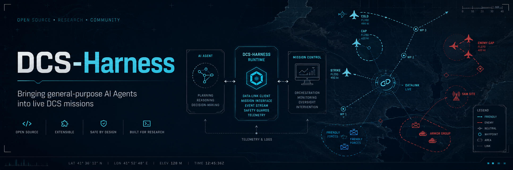
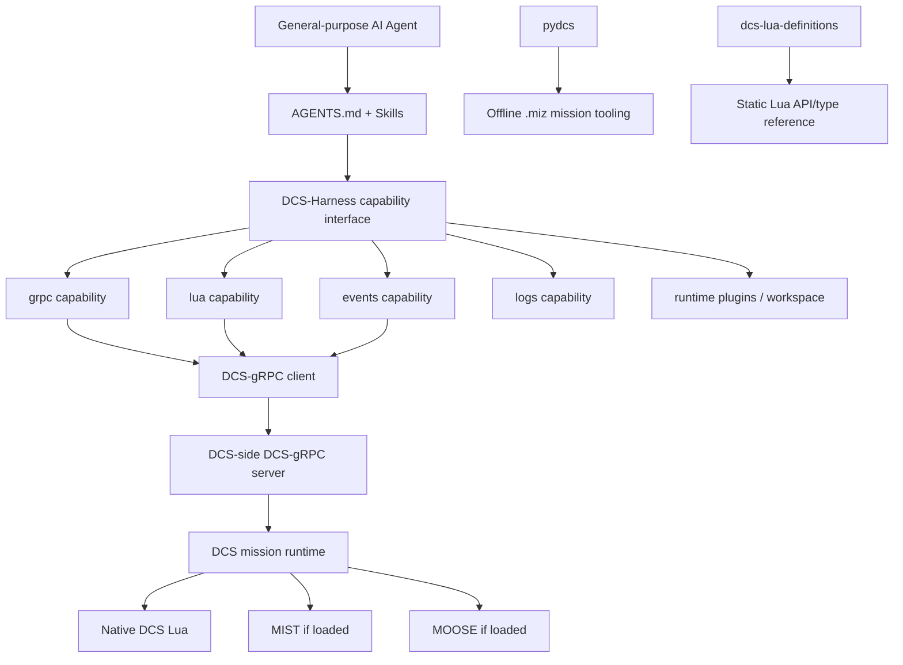

# DCS-Harness

[English](README.md) | [简体中文](README.zh-CN.md)



DCS-Harness 是一个开源框架，目标是让通用 AI Agent 真正进入 DCS World，并作为正在运行任务中的主动参与者持续工作。

与“让 AI 一次性生成一段脚本然后交给游戏执行”不同，DCS-Harness 面向的是能够持续观察当前任务、理解正在发生什么、进行推理、采取行动，并根据行为结果继续调整策略的 Agent。基于这种工作方式，我们希望探索 AI 在 DCS 中可能扮演的新角色，例如动态任务导演、战场指挥官、自适应友军或敌军、Game Master，以及其他形式的实时场景控制者。

DCS-Harness 并不试图取代 DCS 已有的 scripting 和 mission ecosystem。相反，它的目标是把这些现有能力整理成一个更适合 Agent 使用的环境，让 Agent 能够直接利用 DCS 已有的接口、脚本生态和工具，并通过一层轻量的 runtime、工具支持和 Agent-facing knowledge 进行长期交互。

从更广的角度看，DCS-Harness 也在探索一个更一般的问题：通用 AI Agent 能否长期进入一个复杂、成熟的软件环境中工作，而不仅仅是完成一次性的工具调用。DCS 为这个问题提供了一个很有意思的实验场景，因为 Agent 必须面对持续变化的世界状态、真实玩家的自主行为、已经存在的软件接口，并不断验证自己的操作是否真正产生了预期效果。

> DCS-Harness 是一个独立的社区/研究项目，与 Eagle Dynamics 无隶属或官方合作关系。

---

## Background

现代 AI Agent 与传统任务型自动化软件的交互方式正在发生明显变化。传统软件集成通常要求开发者预先定义完整的交互界面：API、workflow、state machine、action schema 以及 orchestration logic。通用 Coding Agent 和 tool-using Agent 则开始具备另一种能力：它们可以自己阅读文档、检查源代码、发现接口、组合已有工具、生成临时代码、诊断错误，并根据环境反馈持续调整行为。因此，一个更有意思的系统问题逐渐出现：**如果我们不是围绕模型重新开发整个软件生态，而只是给 Agent 提供一个足够好的 harness，那么 Agent 到底能在多大程度上直接进入并利用现有的软件系统？**

DCS World 是研究这个问题非常合适的环境。一个 DCS mission 是长时间运行、部分可观测、具有真实玩家自主行为、持续世界状态和战术后果的复杂模拟环境。与许多高频实时动作游戏相比，DCS 的交互节奏相对较慢，使 deliberative Agent 有时间进行观测、推理、介入，并再次检查行为后果。同时，DCS 本身已经拥有相当成熟的可编程生态：native mission Lua、DCS-gRPC、MIST、MOOSE、`.miz` mission 文件、日志以及大量社区工具。因此，DCS 不只是一个“游戏 benchmark”，它还是一个真实的软件生态；Agent 必须自己决定应该观察什么、选用哪一层 abstraction、采取什么动作，以及这个动作是否真的改变了世界。

这也为游戏中的 AI Agent 提供了一种不同于传统 Game AI 的可能性。传统游戏 AI 往往直接被固化在 behavior tree、finite-state machine、手工 planner、scripted director 或固定 NPC logic 中。通用 Agent 则可能工作在这些机制之上的更高层：成为 dynamic mission director、battlefield commander、adaptive game master、scenario orchestrator 或合作型 controller，根据玩家真实行为和当前战局持续调整任务环境。这里最有价值的能力并不是“让 LLM 写一段 Lua”，而是让 Agent 在已有 simulation/tooling ecosystem 中反复完成 **observe → reason → act → verify → adapt**。

从更广的游戏产业角度看，未来 Agent 的角色也未必局限于控制某一个 NPC。Agent 可能逐渐成为能够跨越 runtime state、mission logic、telemetry、内容生成工具、编辑器、debugging interface、persistent memory 以及其他 game-development stack 组件的软件参与者。在这样的环境里，游戏引擎和 modding ecosystem 未来可能不仅需要提供“给开发者调用的 API”，也会逐渐成为**供 Agent 工作的操作环境（operating environment for Agents）**。

最近 general-purpose Agent harness 的快速发展使这类想法明显更容易实现。包括 [DeepSeek Harness](https://www.deepseek.com/harness/) 在内的现代 Coding Agent / Harness 体系越来越强调 model 与外围运行环境之间的分离：tools、skills、sessions、sandboxes、storage、persistent processes 等能力可以围绕 Agent 组合，而不需要全部固化进模型或某个任务专用框架。DCS-Harness 尝试把这种系统设计思想引入实时战斗飞行模拟。我们的目标不是先造出一个庞大的“LLM 战场指挥官”，而是先把 DCS 以及周围的技术生态准备成一个 Agent 可以进入、发现、组合、扩展并长期保持 control loop 的环境。

---

## How to Use

最小可运行环境是：

```text
DCS World
  + 启用 Eval 的 DCS-gRPC
  + DCS-Harness
  = 最小 live Agent environment

可选增强：
  + MIST
  + MOOSE
```

MIST 和 MOOSE 是非常有价值的 mission-side integration，但它们**不是 DCS-Harness core 的强制依赖**。只配置 DCS-gRPC 时，Harness 仍然可以使用 typed RPC、native mission Lua、events 和 logs。

### 1. 前置要求

需要：

- Windows 上的 DCS World；
- Python **3.10 或更高版本**；
- Git；
- 已正确安装的 DCS-gRPC；
- 如果希望实现自主 Agent 操作，还需要一个 AI/Coding Agent；DCS-Harness 本身不打包具体模型或 Agent provider。

如果 DCS 运行在 Windows，而 Agent/Harness 运行在 WSL，请同时阅读下方的 [Windows / WSL networking](#windows--wsl-networking)。

### 2. Clone DCS-Harness

请同时 clone pinned third-party submodules：

```bash
git clone --recurse-submodules https://github.com/yuriak/DCS-Harness.git
cd DCS-Harness
```

如果已经 clone 但没有初始化 submodule：

```bash
git submodule update --init --recursive
```

### 3. 安装 DCS-gRPC

DCS-gRPC 是 DCS 与 DCS-Harness 之间必需的 live bridge。

从上游项目获取当前 release：

- Repository: https://github.com/DCS-gRPC/rust-server
- Releases: https://github.com/DCS-gRPC/rust-server/releases

按照上游安装说明，将 release 解压到对应的 DCS **Saved Games** 目录。一个正常安装通常会提供：

```text
Saved Games\DCS\Scripts\DCS-gRPC\
Saved Games\DCS\Scripts\Hooks\DCS-gRPC.lua
Saved Games\DCS\Mods\Tech\DCS-gRPC\
```

#### 加入 mission scripting hook

DCS-gRPC 还必须进入 DCS 的 mission scripting environment。编辑 DCS 安装目录中的：

```text
DCS World\Scripts\MissionScripting.lua
```

并在 sanitization 之前加入：

```lua
dofile(lfs.writedir()..[[Scripts\DCS-gRPC\grpc-mission.lua]])
```

其顺序概念上应类似：

```lua
dofile('Scripts/ScriptingSystem.lua')

dofile(lfs.writedir()..[[Scripts\DCS-gRPC\grpc-mission.lua]])

-- DCS-gRPC loader 之后才进行 sanitization
sanitizeModule('os')
sanitizeModule('io')
sanitizeModule('lfs')
```

不要拿这个简化片段覆盖原本完整的 `MissionScripting.lua`；这里只需要把 DCS-gRPC loader 插入正确位置。具体安装步骤应以 DCS-gRPC upstream README 的当前版本为准。

> DCS 更新可能覆盖 `MissionScripting.lua`。如果某次更新后 DCS-Harness 突然无法连接 DCS，请重新检查 DCS-gRPC mission hook 是否仍然存在，并且是否仍然位于 sanitization 之前。

#### 开启 autostart 与 Eval

DCS-Harness 在只使用 typed RPC 时并不要求任意 Lua 执行，但 `lua` capability——以及通过 Eval 访问 native mission Lua、MIST 和 MOOSE——需要 `CustomService.Eval`。

创建或修改：

```text
Saved Games\DCS\Config\dcs-grpc.lua
```

推荐的本机配置为：

```lua
autostart = true
evalEnabled = true

host = "127.0.0.1"
port = 50051
```

`autostart = true` 让 DCS-gRPC 不需要依赖某个 mission 中显式调用 `GRPC.load()`。`evalEnabled = true` 则开启 DCS-Harness `lua` capability 使用的 mission-side Lua bridge。

> **安全提示：** Eval 的能力非常强。不要把启用了 Eval、且没有可靠保护的 DCS-gRPC endpoint 暴露到不可信网络。如果为了 WSL 或远程连接把 DCS-gRPC 绑定到 `0.0.0.0`，请认真检查 Windows firewall 与网络暴露范围。

DCS-gRPC 还支持 authentication、throughput、TTS、SRS 等大量配置。DCS-Harness 不会复制完整的上游配置手册，请参考 [DCS-gRPC README](https://github.com/DCS-gRPC/rust-server#readme)。

### 4. 运行 DCS-Harness setup

setup 负责检查本机 DCS 技术环境，并在 repository 内准备 Python/gRPC 所需的生成物。它有意保持保守：**不会替你安装 DCS-gRPC，也不会主动修改 DCS、Saved Games 或 `MissionScripting.lua`**。

Windows：

```bat
setup.bat
```

Linux/WSL：

```bash
./setup.sh
```

如果未显式提供路径，setup 会询问 DCS installation directory 与对应的 DCS Saved Games directory。

也可以 non-interactive 运行：

```bash
./setup.sh \
  --dcs-install-dir "/mnt/c/Program Files/Eagle Dynamics/DCS World" \
  --saved-games-dir "/mnt/c/Users/YOUR_NAME/Saved Games/DCS" \
  --non-interactive
```

使用 `setup.bat` 时请传 Windows native path；在 WSL 中运行时，setup 可以处理 WSL path，并对常见 Windows-style path 进行转换。

setup 会检查 Python 版本、必要 submodules、DCS installation、Saved Games layout、DCS-gRPC 文件与配置、mission scripting hook、protobuf source 和 generated bindings。机器相关的技术状态会写入被 Git ignore 的 `runtime/` 与 `config/environment.yaml`。

### 5. 启动 DCS 与一个 mission

启动 DCS 并进入一个 mission。mission environment 激活后，DCS-gRPC 应进入工作状态。

上游常用诊断文件：

```text
Saved Games\DCS\Logs\dcs.log
Saved Games\DCS\Logs\grpc.log
```

之后 DCS-Harness 自己的 resident `logs` capability 也可以镜像与检索这些日志。

### 6. 启动 DCS-Harness resident runtime

Linux/WSL：

```bash
runtime/venv/bin/python tools/src/py/dcs_harness.py serve
```

Windows：

```bat
runtime\venv\Scripts\python.exe tools\src\py\dcs_harness.py serve
```

这个 resident Harness server 是一个本地 loopback service，用于托管 events、logs 等 stateful capability。它**不是** DCS-gRPC server；真正的 DCS-gRPC 仍然是 DCS 一侧独立运行的服务。

### 7. 验证 live connection

在另一个 terminal 中先做 capability discovery。

Linux/WSL：

```bash
runtime/venv/bin/python tools/src/py/dcs_harness.py \
  --backend auto grpc services
```

Windows：

```bat
runtime\venv\Scripts\python.exe tools\src\py\dcs_harness.py --backend auto grpc services
```

查看 Lua capability：

```bash
runtime/venv/bin/python tools/src/py/dcs_harness.py \
  --backend auto plugins describe lua
```

执行一个无害的 Lua Eval smoke test：

```bash
runtime/venv/bin/python tools/src/py/dcs_harness.py \
  --backend auto \
  --args-json '{"code":"return 2 + 2"}' \
  lua eval
```

检查 resident events / logs collector：

```bash
runtime/venv/bin/python tools/src/py/dcs_harness.py \
  --backend auto events status

runtime/venv/bin/python tools/src/py/dcs_harness.py \
  --backend auto logs status
```

如果 `grpc services` 可以工作、Lua Eval 正常返回、resident capability 状态健康，那么最小 Harness 环境就已经打通。

### 8. 可选：加载 MIST

[MIST (Mission Scripting Tools)](https://github.com/mrSkortch/MissionScriptingTools) 是一个 mission-side Lua utility library，常用于 mission databases、routing、scheduling、geometry、dynamic groups 以及大量常见 scripting task。

要让 DCS-Harness 使用 MIST，MIST 必须先被加载到**当前 mission runtime**。常见做法是：

1. 从 MIST 项目取得当前 `mist.lua`；
2. 用 DCS Mission Editor 打开任务；
3. 建立一个较早触发的 mission trigger；
4. 添加 `DO SCRIPT FILE` action 并加载 `mist.lua`；
5. 确保依赖 MIST 的其他脚本在其后执行。

加载完成后，DCS-Harness 可以通过 `lua` capability 访问全局 `mist` table。

本项目使用 Git submodule pin 了一份 MIST 源码，用于 reference 与 reproducibility；**submodule 存在并不意味着 MIST 已自动进入正在运行的 DCS mission**。

### 9. 可选：加载 MOOSE

[MOOSE](https://github.com/FlightControl-Master/MOOSE) 是一个更高层的 object-oriented mission scripting framework。对于需要持续 orchestration、可复用 domain abstractions、复杂 tasking 或 framework-managed mission behavior 的任务，它通常比手写大量 native Lua 更方便。

MOOSE 的标准加载模式是：

```text
MISSION START
  -> DO SCRIPT FILE
  -> Moose_.lua
```

然后确保依赖 MOOSE 的 mission script 在 MOOSE framework **之后**执行。

MOOSE 官方 beginner documentation 提供完整教程：

- https://flightcontrol-master.github.io/MOOSE_DOCS/

MOOSE 被 mission 加载以后，DCS-Harness 就可以通过 mission-side Lua Eval 调用其 classes/objects。MOOSE framework object 应继续留在 Lua runtime 中，对外只返回小型、JSON-safe 的事实或 identifier。

与 MIST 一样，repository 中 pinned 的 MOOSE submodule 只是 source/reference，并不会自行注入当前 mission。

### Windows / WSL networking

一个常见开发方式是：

```text
DCS World       -> Windows
DCS-gRPC server -> Windows / DCS process
DCS-Harness     -> WSL
AI Agent        -> WSL
```

此时 WSL 内部的 `127.0.0.1` 不一定指向 Windows 上运行 DCS 的网络 namespace。

可能需要让 DCS-gRPC 监听 WSL 可达地址，例如：

```lua
host = "0.0.0.0"
port = 50051
```

同时在本地、被 Git ignore 的：

```text
config/environment.yaml
```

中把 Harness client endpoint 设置为 Windows 主机从 WSL 可访问的具体地址：

```yaml
grpc:
  client_host: "<Windows host IP reachable from WSL>"
  port: 50051
```

请明确区分：

```text
0.0.0.0
= server bind address

client_host
= Harness client 实际连接的具体地址
```

把 DCS-gRPC bind 到 `0.0.0.0` 可能使服务不再局限于 localhost。特别是在开启 Eval 时，请配合 Windows firewall / network policy 限制不可信访问。

### 10. 启动 Agent

在 repository root 启动你的 Coding / General-purpose Agent。

项目提供：

```text
AGENTS.md
skills/operation/
skills/integration/
skills/directing/
```

`AGENTS.md` 是 Agent 的永久入口。三个 skill 使用 progressive disclosure：只有任务需要时，Agent 才进一步读取 operation、integration 或 directing 相关知识；如果仍需更深细节，再直接查看当前 Harness 源码、generated protobuf descriptors 或 pinned third-party source。

第一次使用时，一个合适的指令是：先让 Agent 阅读 `AGENTS.md`，检查当前 Harness/runtime 状态，并汇报 live DCS 中已经可用的 capability，再进行任何实质性战场干预。

---

## Architecture

DCS-Harness 刻意保持 durable core 较薄。Harness 的职责是提供 generic、discoverable 的观测与操作能力；Agent 的职责是理解这些信息、规划下一步并决定任务应该如何发展。

### Logical model



DCS-Harness 是 DCS-side DCS-gRPC 服务的**外部 client**。Harness 自己的 resident HTTP server 则是另一个独立的 loopback-only process，用于保留 resident capability state。

### Built-in capabilities

| Capability | 作用 |
| --- | --- |
| `grpc` | 基于 protobuf descriptor 的 typed **unary** DCS-gRPC service discovery 与 invocation。 |
| `lua` | Mission-side Lua Eval，以及受控的 repository-local Lua file execution。 |
| `events` | Resident、按 DCS-gRPC session 隔离的事实事件 chronology。 |
| `logs` | Resident DCS / DCS-gRPC diagnostic log mirror、tail 与 search。 |
| Runtime plugins | Agent 创建的 task-local Python/Lua capability，用于重复但仍实验性的组合操作。 |
| Agent skills | 面向 operation、integration 与 directing 的渐进式 Agent knowledge。 |
| Memory | 预留给未来跨 mission 的 campaign continuity；当前尚未实现。 |

几个语义边界是刻意保留的：

```text
events != 完整的 current world state
logs   != battlefield truth
pydcs  != live simulator access
memory != 已实现的 campaign system
```

需要了解“现在世界是什么状态”时，Agent 应优先使用 current typed RPC 和/或 focused mission-runtime Lua observation。Events 更适合作为 chronology；logs 则用于 diagnostics。

### Runtime model

DCS-Harness 把不同类型的 continuity 分开管理：

```text
DCS process epoch
  -> logs

DCS-gRPC mission/session
  -> events

未来跨 mission campaign continuity
  -> memory
```

新的 DCS-gRPC session 代表新的 current battle context。Event ledger 按 session 隔离。Logs 跟随当前 DCS process-log epoch，并在上游 log source 被替换、重建或 truncate 时进行 rotation。

Harness 本身可以使用：

- **direct**：一次性 transient stateless invocation；
- **server**：通过 resident loopback runtime 执行；
- **auto**：resident server 可用时优先使用，否则按照当前实现进行 direct fallback。

当前 resident runtime 会 autostart `events`、`logs` 等需要保持状态的 built-in capability。

### Repository structure

```text
DCS-Harness/
├── AGENTS.md                 # Agent constitution 与 skill router
├── skills/                   # Progressive Agent knowledge
│   ├── operation/
│   ├── integration/
│   └── directing/
├── tools/                    # Durable Harness implementation
├── runtime/                  # Generated/local/Agent task state
├── config/                   # Technical environment template + local config
├── third_party/              # Pinned upstream Git submodules
├── tests/                    # Automated contract/regression tests
├── setup.sh
├── setup.bat
└── pyproject.toml
```

重要的 runtime ownership：

```text
runtime/workspace/
  -> Agent scratch files 与 task-local artifacts

runtime/plugins/
  -> task-local Agent extensions

runtime/events/
runtime/logs/
runtime/server.json
  -> Harness-owned runtime state
```

机器相关 environment config、generated protobuf bindings、logs、event database、virtual environment 以及 Agent workspace artifact 都默认被 Git ignore。

### Design principles

DCS-Harness 采用 substrate-first 的设计原则：

1. **保持 core generic。** Scenario strategy、pacing、doctrine、objectives 和 narrative intelligence 属于 Agent，而不是 built-in plugin。
2. **优先使用已有 DCS ecosystem。** 尽量利用 DCS-gRPC、native Lua、MIST、MOOSE、pydcs 等既有能力，而不是重新实现。
3. **发现接口，而不是猜接口。** Typed gRPC 由 descriptor 驱动；Agent 应检查当前 schema/source，而不是依赖记忆中的 API。
4. **Observe, act, verify。** 一个 command 返回成功，只能证明调用已执行，并不总能证明预期战术效果真的发生。
5. **一次性逻辑留在 runtime。** Mission-specific code 先作为 task-local artifact，只有反复使用后才考虑提升为稳定 abstraction。
6. **由证据推动 promotion。** Durable capability 与高层 directing rule 应来自 dogfooding 中反复出现的真实需求，而不是提前猜测。
7. **不要用固定时间轴替代 Agent。** 长时间 directing 应保持 live iterative loop，而不是退化成一次性生成 `T+5 / T+10 / T+20` 的 deterministic script。

Agent-facing knowledge system 也遵循同样原则。`AGENTS.md` 只保存长期有效的 project invariant 和 skill routing；`operation`、`integration`、`directing` 分层提供更具体的知识，而 exact API 最终仍以当前源码、generated protobuf descriptor 和 pinned third-party code 为 authority。

---

## Third-party Ecosystem

DCS-Harness 的目标不是取代已有 DCS scripting community，而是把这些成熟能力组织成一个 Agent 可以可靠使用的环境。

| Project | DCS-Harness 为什么引入它 |
| --- | --- |
| [DCS-gRPC](https://github.com/DCS-gRPC/rust-server) | DCS 的 live cross-process bridge，提供 typed protobuf RPC、mission event stream、session identity，以及进入 mission-side Lua 的 `CustomService.Eval`。 |
| [MIST](https://github.com/mrSkortch/MissionScriptingTools) | 成熟的 mission-side Lua utility layer，用于常见 scripting task、mission database、routing、scheduling、geometry 与 dynamic mission helper。 |
| [MOOSE](https://github.com/FlightControl-Master/MOOSE) | 高层 object-oriented mission scripting framework，用于 persistent orchestration、tasking、可复用 domain abstraction 和复杂 mission behavior。 |
| [pydcs](https://github.com/pydcs/dcs) | Python 侧的 offline `.miz` mission 读取、创建与修改工具，以及静态 DCS data model；它不是 live state API。 |
| [dcs-lua-definitions](https://github.com/omltcat/dcs-lua-definitions) | 社区维护的 Lua static definitions，帮助 Agent/开发者查找 DCS scripting class、function、enum 与 signature；最终仍以 live DCS behavior 为准。 |

这些项目都是独立的 upstream work。DCS-Harness 使用 Git submodule pin 对应版本，以便 reproducibility 与 source inspection。每个第三方项目继续遵循其各自的 license 与 upstream terms。

---

## License

DCS-Harness 使用 **Apache License 2.0**。见 [LICENSE](LICENSE)。

`third_party/` 下的第三方项目不会因为被 DCS-Harness 引入而重新授权，它们仍然分别遵循自己的 upstream license。

---

## Credits

DCS-Harness 建立在 DCS scripting 与 modding 社区多年积累之上。特别感谢 DCS-gRPC、MIST、MOOSE、pydcs 与 dcs-lua-definitions 的维护者和贡献者，使 DCS 的 scripting ecosystem 能够被外部程序、研究人员与 Agent 继续复用和扩展。

我们也感谢更广泛的 Agent tooling 社区。近年来 Coding Agent、tool-use harness、persistent runtime、skills 和 software-environment interaction 方面的工作，直接推动了本项目背后的研究问题。

### Citation

我们计划后续发表正式介绍 DCS-Harness 的研究论文。在 paper citation 可用之前，可以先引用软件仓库：

```bibtex
@software{dcs_harness_2026,
  author  = {{DCS-Harness Contributors}},
  title   = {DCS-Harness: An Agent-Native Technical Substrate for DCS World},
  year    = {2026},
  url     = {https://github.com/yuriak/DCS-Harness},
  version = {0.1.0}
}
```

如果你在研究工作中使用 DCS-Harness，请在正式发表前再次查看 repository，以获取后续更新的 paper citation。
